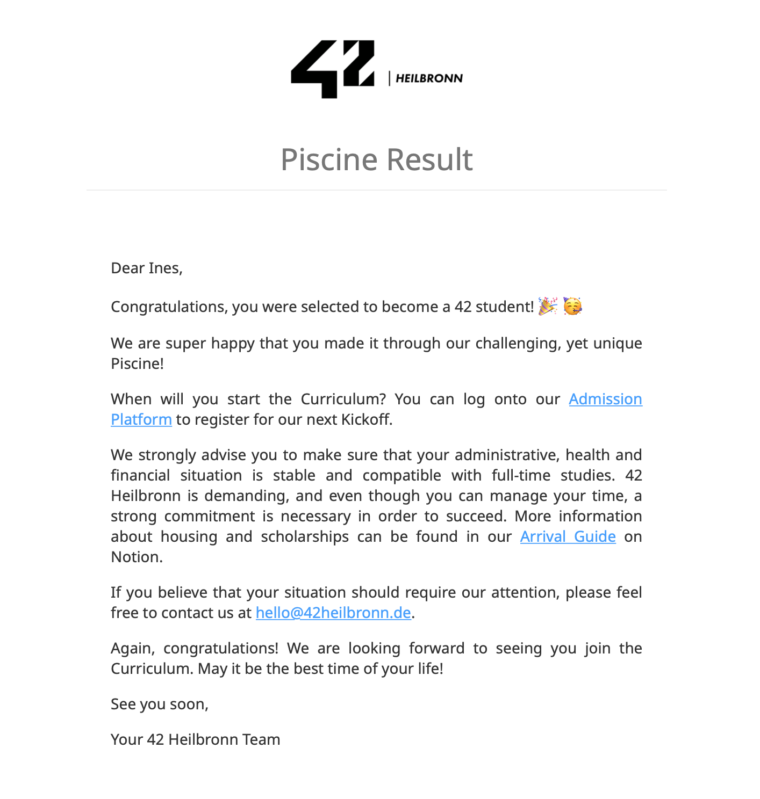

# 42-Piscine
This repository captures the culmination of tasks completed throughout the 42 Heilbronn Piscine. The Piscine serves as an immersive coding bootcamp, fostering hands-on projects, challenges, and collaborative learning experiences.

Key Points:
* Solutions to diverse programming challenges and projects assigned during the Piscine are included in the codebase.
* Each directory corresponds to a specific day or project, ensuring organized navigation.
* Explore the code for learning purposes and feel free to engage in collaboration or discussions.

**Update: I've been accepted to 42 !**

I'm excited to continue my journey at 42 after successfully completing the Piscine. The contents of this repository represent both individual efforts and collaborative work with fellow participants during the Piscine. They reflect personal learning journeys and coding styles. <3

**Contributing**
- Contributions are welcome ˶ᵔ ᵕ ᵔ˶ Feel free to [open issues](https://github.com/InesZenkri/42-Piscine/issues) or submit pull requests. 🤝

**License**

- This project is licensed under the [MIT License](LICENSE). 📜

